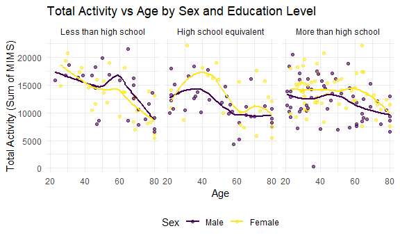

p8105_hw3_cm3341
================
Carolina Montes Garcia
2024-10-15

- [Problem 1](#problem-1)
- [Problem 2](#problem-2)
- [Problem 3](#problem-3)

Load tidyverse for its functions, tidy syntax and operators, tibbles,
and because it includes ggplot2. Load readxl to read csv data files.

``` r
library(tidyverse)
```

    ## ── Attaching core tidyverse packages ──────────────────────── tidyverse 2.0.0 ──
    ## ✔ dplyr     1.1.4     ✔ readr     2.1.5
    ## ✔ forcats   1.0.0     ✔ stringr   1.5.1
    ## ✔ ggplot2   3.5.1     ✔ tibble    3.2.1
    ## ✔ lubridate 1.9.3     ✔ tidyr     1.3.1
    ## ✔ purrr     1.0.2     
    ## ── Conflicts ────────────────────────────────────────── tidyverse_conflicts() ──
    ## ✖ dplyr::filter() masks stats::filter()
    ## ✖ dplyr::lag()    masks stats::lag()
    ## ℹ Use the conflicted package (<http://conflicted.r-lib.org/>) to force all conflicts to become errors

``` r
library(knitr)
library(ggplot2)
```

## Problem 1

## Problem 2

Load in the two nhanes datasets including demographic information and
accelerometer data

``` r
nhanes_demo = 
  read_csv("data/nhanes_covar.csv", 
    skip = 4, 
    na = c("NA", "."))%>%
  janitor::clean_names() %>% 
  filter(age >= 21)%>%
  mutate(
    education = 
      factor(education, 
             levels = c(1, 2, 3), 
             labels = c("Less than high school",
                        "High school equivalent",
                        "More than high school")),
    sex = 
      factor(sex,
             levels = c(1, 2),
             labels = c("Male", "Female")))
```

    ## Rows: 250 Columns: 5
    ## ── Column specification ────────────────────────────────────────────────────────
    ## Delimiter: ","
    ## dbl (5): SEQN, sex, age, BMI, education
    ## 
    ## ℹ Use `spec()` to retrieve the full column specification for this data.
    ## ℹ Specify the column types or set `show_col_types = FALSE` to quiet this message.

``` r
nhanes_accel = 
  read_csv("data/nhanes_accel.csv", 
  na = c("NA", "."))%>%
  janitor::clean_names()%>%
  pivot_longer(
    min1:min1440,
    names_to = "minute",
    values_to = "mims")
```

    ## Rows: 250 Columns: 1441
    ## ── Column specification ────────────────────────────────────────────────────────
    ## Delimiter: ","
    ## dbl (1441): SEQN, min1, min2, min3, min4, min5, min6, min7, min8, min9, min1...
    ## 
    ## ℹ Use `spec()` to retrieve the full column specification for this data.
    ## ℹ Specify the column types or set `show_col_types = FALSE` to quiet this message.

Join the two datasets using `left_join` by the *seqn* variable.

``` r
full_nhanes = 
  nhanes_accel %>%
  left_join(
    nhanes_demo, by = c("seqn"))%>%
  drop_na()
```

Produce a reader-friendly table for the number of men and women in each
education category.

``` r
edu_by_sex_table = 
  full_nhanes %>%
  group_by(education, sex) %>%
  summarise(count = n()) %>%
  ungroup()
```

    ## `summarise()` has grouped output by 'education'. You can override using the
    ## `.groups` argument.

``` r
kable(edu_by_sex_table, col.names = c("Education", "Sex", "Count"))
```

| Education              | Sex    | Count |
|:-----------------------|:-------|------:|
| Less than high school  | Male   | 38880 |
| Less than high school  | Female | 40320 |
| High school equivalent | Male   | 50400 |
| High school equivalent | Female | 33120 |
| More than high school  | Male   | 80640 |
| More than high school  | Female | 84960 |

Create a visualization of the age distributions for men and women in
each education category.

``` r
ggplot(
  full_nhanes, 
  aes(x = education, 
      y = age, 
      fill = sex)) +
  geom_boxplot() +
  labs(title = "Age Distribution by Education and Sex",
       x = "Education Category",
       y = "Age") +
  theme_minimal()
```


``` r
full_nhanes %>% 
  group_by(education, sex) %>% 
  summarise(median(age))
```

    ## `summarise()` has grouped output by 'education'. You can override using the
    ## `.groups` argument.

    ## # A tibble: 6 × 3
    ## # Groups:   education [3]
    ##   education              sex    `median(age)`
    ##   <fct>                  <fct>          <dbl>
    ## 1 Less than high school  Male            60  
    ## 2 Less than high school  Female          61  
    ## 3 High school equivalent Male            53  
    ## 4 High school equivalent Female          62  
    ## 5 More than high school  Male            43.5
    ## 6 More than high school  Female          41

The boxplots for age distribution of men and women by education category
illustrates that out of the sample of nhanes participants for whom we
have complete accelerometer and demographic data, the median age for
males was highest in the *Less than high school* group, followed by the
*High school equivalent* group, with the *More than high school* group
having the lowest median age for males. For females, the highest median
age of participation was in the *High school equivalent* group, followed
by the *Less than high school* and *More than high* groups.

The data table showing counts of males and females by education category
notes that most participants in this sample fell into the *More than
high school* education category.

``` r
total_activity_data = full_nhanes %>%
  group_by(seqn, sex, age, education) %>%
  summarise(total_activity = sum(mims, na.rm = TRUE)) %>%
  ungroup()
```

    ## `summarise()` has grouped output by 'seqn', 'sex', 'age'. You can override
    ## using the `.groups` argument.

``` r
ggplot(total_activity_data, aes(x = age, y = total_activity, color = sex)) +
  geom_point(alpha = 0.6) +   
  geom_smooth(method = "loess", se = FALSE) +
  facet_wrap(~education) +
  labs(title = "Total Activity vs Age by Sex and Education Level",
       x = "Age",
       y = "Total Activity (Sum of MIMS)",
       color = "Sex") +
  theme_minimal() +
  theme(legend.position = "bottom")
```

    ## `geom_smooth()` using formula = 'y ~ x'



According to the graphs,

Accelerometer data allows the inspection activity over the course of the
day. Make a three-panel plot that shows the 24-hour activity time
courses for each education level and use color to indicate sex. Describe
in words any patterns or conclusions you can make based on this graph;
including smooth trends may help identify differences.

## Problem 3

Import the four citibike datasets

``` r
citi_012020 = 
  read_csv("data/Jan 2020 Citi.csv", 
    na = c("NA", "."))%>%
  janitor::clean_names() %>% 
  na.omit()
```

    ## Rows: 12420 Columns: 7
    ## ── Column specification ────────────────────────────────────────────────────────
    ## Delimiter: ","
    ## chr (6): ride_id, rideable_type, weekdays, start_station_name, end_station_n...
    ## dbl (1): duration
    ## 
    ## ℹ Use `spec()` to retrieve the full column specification for this data.
    ## ℹ Specify the column types or set `show_col_types = FALSE` to quiet this message.

``` r
citi_012024 = 
  read_csv("data/Jan 2024 Citi.csv", 
    na = c("NA", "."))%>%
  janitor::clean_names() %>% 
  na.omit()
```

    ## Rows: 18861 Columns: 7
    ## ── Column specification ────────────────────────────────────────────────────────
    ## Delimiter: ","
    ## chr (6): ride_id, rideable_type, weekdays, start_station_name, end_station_n...
    ## dbl (1): duration
    ## 
    ## ℹ Use `spec()` to retrieve the full column specification for this data.
    ## ℹ Specify the column types or set `show_col_types = FALSE` to quiet this message.

``` r
citi_072020 = 
  read_csv("data/July 2020 Citi.csv", 
    na = c("NA", "."))%>%
  janitor::clean_names() %>% 
  na.omit()
```

    ## Rows: 21048 Columns: 7
    ## ── Column specification ────────────────────────────────────────────────────────
    ## Delimiter: ","
    ## chr (6): ride_id, rideable_type, weekdays, start_station_name, end_station_n...
    ## dbl (1): duration
    ## 
    ## ℹ Use `spec()` to retrieve the full column specification for this data.
    ## ℹ Specify the column types or set `show_col_types = FALSE` to quiet this message.

``` r
citi_072024 = 
  read_csv("data/July 2024 Citi.csv", 
    na = c("NA", "."))%>%
  janitor::clean_names() %>% 
  na.omit()
```

    ## Rows: 47156 Columns: 7
    ## ── Column specification ────────────────────────────────────────────────────────
    ## Delimiter: ","
    ## chr (6): ride_id, rideable_type, weekdays, start_station_name, end_station_n...
    ## dbl (1): duration
    ## 
    ## ℹ Use `spec()` to retrieve the full column specification for this data.
    ## ℹ Specify the column types or set `show_col_types = FALSE` to quiet this message.
