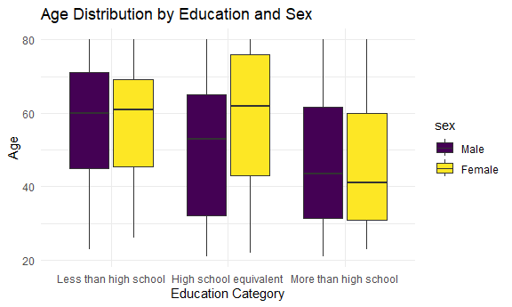

p8105_hw3_cm3341
================
Carolina Montes Garcia
2024-10-15

- [Problem 1](#problem-1)
- [Problem 2](#problem-2)
- [Problem 3](#problem-3)

Load tidyverse for its functions, tidy syntax and operators, tibbles,
and because it includes ggplot2. Load readxl to read csv data files.

``` r
library(tidyverse)
```

    ## ── Attaching core tidyverse packages ──────────────────────── tidyverse 2.0.0 ──
    ## ✔ dplyr     1.1.4     ✔ readr     2.1.5
    ## ✔ forcats   1.0.0     ✔ stringr   1.5.1
    ## ✔ ggplot2   3.5.1     ✔ tibble    3.2.1
    ## ✔ lubridate 1.9.3     ✔ tidyr     1.3.1
    ## ✔ purrr     1.0.2     
    ## ── Conflicts ────────────────────────────────────────── tidyverse_conflicts() ──
    ## ✖ dplyr::filter() masks stats::filter()
    ## ✖ dplyr::lag()    masks stats::lag()
    ## ℹ Use the conflicted package (<http://conflicted.r-lib.org/>) to force all conflicts to become errors

``` r
library(readxl)
library(knitr)
library(ggplot2)
```

## Problem 1

## Problem 2

Load in the two nhanes datasets including demographic information and
accelerometer data

``` r
nhanes_demo = 
  read_csv("data/nhanes_covar.csv", 
    skip = 4, 
    na = c("NA", "."))%>%
  janitor::clean_names() %>% 
  na.omit() %>% 
  filter(age >= 21)%>%
  mutate(
    education = 
      factor(education, 
             levels = c(1, 2, 3), 
             labels = c("Less than high school",
                        "High school equivalent",
                        "More than high school")),
    sex = 
      factor(sex,
             levels = c(1, 2),
             labels = c("Male", "Female")))
```

    ## Rows: 250 Columns: 5
    ## ── Column specification ────────────────────────────────────────────────────────
    ## Delimiter: ","
    ## dbl (5): SEQN, sex, age, BMI, education
    ## 
    ## ℹ Use `spec()` to retrieve the full column specification for this data.
    ## ℹ Specify the column types or set `show_col_types = FALSE` to quiet this message.

``` r
nhanes_accel = 
  read_csv("data/nhanes_accel.csv", 
  na = c("NA", "."))%>%
  janitor::clean_names()%>%
  pivot_longer(
    min1:min1440,
    names_to = "minute",
    values_to = "mims")
```

    ## Rows: 250 Columns: 1441
    ## ── Column specification ────────────────────────────────────────────────────────
    ## Delimiter: ","
    ## dbl (1441): SEQN, min1, min2, min3, min4, min5, min6, min7, min8, min9, min1...
    ## 
    ## ℹ Use `spec()` to retrieve the full column specification for this data.
    ## ℹ Specify the column types or set `show_col_types = FALSE` to quiet this message.

Join the two datasets using `left_join`

``` r
full_nhanes = 
  nhanes_accel %>%
  left_join(
    nhanes_demo, by = c("seqn"))
```

Produce a reader-friendly table for the number of men and women in each
education category.

``` r
table_data = 
  nhanes_demo %>%
  group_by(education, sex) %>%
  summarise(count = n()) %>%
  ungroup()
```

    ## `summarise()` has grouped output by 'education'. You can override using the
    ## `.groups` argument.

``` r
kable(table_data, col.names = c("Education", "Sex", "Count"))
```

| Education              | Sex    | Count |
|:-----------------------|:-------|------:|
| Less than high school  | Male   |    27 |
| Less than high school  | Female |    28 |
| High school equivalent | Male   |    35 |
| High school equivalent | Female |    23 |
| More than high school  | Male   |    56 |
| More than high school  | Female |    59 |

Create a visualization of the age distributions for men and women in
each education category.

``` r
ggplot(
  nhanes_demo, 
  aes(x = education, 
      y = age, 
      fill = sex)) +
  geom_boxplot() +
  labs(title = "Age Distribution by Education and Sex",
       x = "Education Category",
       y = "Age") +
  theme_minimal()
```



## Problem 3
