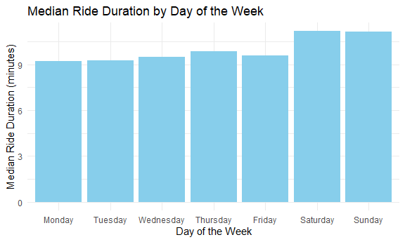

p8105_hw3_cm3341
================
Carolina Montes Garcia
2024-10-15

- [Problem 1](#problem-1)
- [Problem 2](#problem-2)
- [Problem 3](#problem-3)

Load tidyverse for its functions, tidy syntax and operators, tibbles,
and because it includes ggplot2. Load readxl to read csv data files.

``` r
library(tidyverse)
```

    ## ── Attaching core tidyverse packages ──────────────────────── tidyverse 2.0.0 ──
    ## ✔ dplyr     1.1.4     ✔ readr     2.1.5
    ## ✔ forcats   1.0.0     ✔ stringr   1.5.1
    ## ✔ ggplot2   3.5.1     ✔ tibble    3.2.1
    ## ✔ lubridate 1.9.3     ✔ tidyr     1.3.1
    ## ✔ purrr     1.0.2     
    ## ── Conflicts ────────────────────────────────────────── tidyverse_conflicts() ──
    ## ✖ dplyr::filter() masks stats::filter()
    ## ✖ dplyr::lag()    masks stats::lag()
    ## ℹ Use the conflicted package (<http://conflicted.r-lib.org/>) to force all conflicts to become errors

``` r
library(knitr)
library(ggplot2)
library(ggridges)
library(patchwork)

library(p8105.datasets)
```

## Problem 1

#### Read in the data

``` r
data("ny_noaa")
```

#### Answer questions about the data

This dataset contains 2595176 rows and 7 columns. Variables include
weather station id, date of observation, (tenths of mm), snowfall (mm),
snow depth (mm), and min and max temperature (tenths of degrees C).

Below we clean the data, creating separate variables for year, month,
and day and converting `tmax` and `tmin` to numeric. We find that 0 is
the most commonly observed value for snowfall. This is because most days
of the year, it does not snow at all in NY. The second most commonly
observed value is `NA`, indicating missingness. Other common values are
13, 25, and 51, suggesting that snowfall is originally recorded in
fractions of an inch and converted to mm.

``` r
ny_noaa %>% 
  count(snow) %>%
  arrange(desc(n))
```

    ## # A tibble: 282 × 2
    ##     snow       n
    ##    <int>   <int>
    ##  1     0 2008508
    ##  2    NA  381221
    ##  3    25   31022
    ##  4    13   23095
    ##  5    51   18274
    ##  6    76   10173
    ##  7     8    9962
    ##  8     5    9748
    ##  9    38    9197
    ## 10     3    8790
    ## # ℹ 272 more rows

``` r
ny_noaa = 
  ny_noaa %>% 
  separate(date, into = c("year", "month", "day"), convert = TRUE) %>% 
  mutate(
    tmax = as.numeric(tmax),
    tmin = as.numeric(tmin))
```

Below is a two-panel plot showing the average max temperature in January
and in July in each station across years. As expected, the mean
temperature in January is much lower than the mean temperature in July
for all stations and across all years. All stations appear to follow
similar trends of temperature peaks and valleys within a month across
the years, i.e. when one station has a high monthly mean temperature for
a given year, most other stations also have a high monthly mean
temperature for that year. We do see one uncharacteristically cold
station in July of 1987 or 1988, as well as a few other less drastic
outliers.

``` r
ny_noaa %>% 
  group_by(id, year, month) %>% 
  filter(month %in% c(1, 7)) %>% 
  summarize(mean_tmax = mean(tmax, na.rm = TRUE, color = id)) %>% 
  ggplot(aes(x = year, y = mean_tmax, group = id)) + geom_point() + geom_path() +
  facet_grid(~month) +
  labs(title = "Mean monthly temperature for each station across years for January and July")
```

    ## `summarise()` has grouped output by 'id', 'year'. You can override using the
    ## `.groups` argument.

    ## Warning: Removed 5970 rows containing missing values or values outside the scale range
    ## (`geom_point()`).

    ## Warning: Removed 5931 rows containing missing values or values outside the scale range
    ## (`geom_path()`).


Below we show a two-panel plot including (i) a hex plot of `tmax` vs
`tmin` for the full dataset; and (ii) a ridge plot showing the
distribution of snowfall values (in mm) greater than 0 and less than 100
separately by year.

From the hex plot we see that while there is some variability, the
majority of the data cluster tightly in the center of the distribution.
In relatively rare cases, it seems that `tmax` is less than `tmin`,
which raises questions about data recording and quality.

From the ridge plot, we see a multimodal density of snowfall within a
given year. Most stations see between 0 and 35 mm of snow in a year.
Then there is a another group of stations that see about 45 mm of snow,
and another group that sees nearly 80 mm. It is likely this
multimodality stems from the conversion of measurements in one system
(fractions of an inch) to another (using the metric system), which was
also noted in the table of common values.

``` r
hex = 
  ny_noaa %>% 
  ggplot(aes(x = tmin, y = tmax)) + 
  geom_hex()

ridge = 
  ny_noaa %>% 
  filter(snow < 100, snow > 0) %>%
  ggplot(aes(x = snow, y = as.factor(year))) + 
  geom_density_ridges()

hex + ridge
```

    ## Warning: Removed 1136276 rows containing non-finite outside the scale range
    ## (`stat_binhex()`).

    ## Picking joint bandwidth of 3.76


## Problem 2

Load in the two nhanes datasets including demographic information and
accelerometer data. I run the usual data cleaning functions to
standardize how missing values are labeled, and clean names to snake
case. For the demographics dataset, I skipped the top 4 rows because
they contain extra information, and in the same code chunk I filtered to
only include ages \>=21. I also relabeled the education and sex
variables and coded them as factors. For the accelerometer dataset, I
`pivot_longer` the MIMS data and created two separate variables for the
distinct minute of each recording per participant and the MIMS value
collected at that minute.

``` r
nhanes_demo = 
  read_csv("data/nhanes_covar.csv", 
    skip = 4, 
    na = c("NA", "."))%>%
  janitor::clean_names() %>% 
  filter(age >= 21)%>%
  mutate(
    education = 
      factor(education, 
             levels = c(1, 2, 3), 
             labels = c("Less than high school",
                        "High school equivalent",
                        "More than high school")),
    sex = 
      factor(sex,
             levels = c(1, 2),
             labels = c("Male", "Female")))
```

    ## Rows: 250 Columns: 5
    ## ── Column specification ────────────────────────────────────────────────────────
    ## Delimiter: ","
    ## dbl (5): SEQN, sex, age, BMI, education
    ## 
    ## ℹ Use `spec()` to retrieve the full column specification for this data.
    ## ℹ Specify the column types or set `show_col_types = FALSE` to quiet this message.

``` r
nhanes_accel = 
  read_csv("data/nhanes_accel.csv", 
  na = c("NA", "."))%>%
  janitor::clean_names()%>%
  pivot_longer(
    min1:min1440,
    names_to = "minute",
    values_to = "mims")
```

    ## Rows: 250 Columns: 1441
    ## ── Column specification ────────────────────────────────────────────────────────
    ## Delimiter: ","
    ## dbl (1441): SEQN, min1, min2, min3, min4, min5, min6, min7, min8, min9, min1...
    ## 
    ## ℹ Use `spec()` to retrieve the full column specification for this data.
    ## ℹ Specify the column types or set `show_col_types = FALSE` to quiet this message.

Join the two datasets using `left_join` by the *seqn* variable.

``` r
full_nhanes = 
  nhanes_accel %>%
  left_join(
    nhanes_demo, by = c("seqn"))%>%
  drop_na()
```

Produce a reader-friendly table for the number of men and women in each
education category.

``` r
edu_by_sex_table = 
  full_nhanes %>%
  group_by(education, sex) %>%
  summarise(count = n())
```

    ## `summarise()` has grouped output by 'education'. You can override using the
    ## `.groups` argument.

``` r
kable(edu_by_sex_table, col.names = c("Education", "Sex", "Count"))
```

| Education              | Sex    | Count |
|:-----------------------|:-------|------:|
| Less than high school  | Male   | 38880 |
| Less than high school  | Female | 40320 |
| High school equivalent | Male   | 50400 |
| High school equivalent | Female | 33120 |
| More than high school  | Male   | 80640 |
| More than high school  | Female | 84960 |

Create a visualization of the age distributions for men and women in
each education category.

``` r
ggplot(
  full_nhanes, 
  aes(x = education, 
      y = age, 
      fill = sex)) +
  geom_boxplot() +
  labs(title = "Age Distribution by Education and Sex",
       x = "Education Category",
       y = "Age") +
  theme_minimal()
```


``` r
full_nhanes %>% 
  group_by(education, sex) %>% 
  summarise(median(age))
```

    ## `summarise()` has grouped output by 'education'. You can override using the
    ## `.groups` argument.

    ## # A tibble: 6 × 3
    ## # Groups:   education [3]
    ##   education              sex    `median(age)`
    ##   <fct>                  <fct>          <dbl>
    ## 1 Less than high school  Male            60  
    ## 2 Less than high school  Female          61  
    ## 3 High school equivalent Male            53  
    ## 4 High school equivalent Female          62  
    ## 5 More than high school  Male            43.5
    ## 6 More than high school  Female          41

Pull some key values for my summary

``` r
age_value = nhanes_demo %>% #use this to pull median ages and counts from the tables I created
  filter(seqn == 2) %>% 
  pull(age)
```

Interpretation: The boxplots for age distribution of men and women by
education category illustrates that out of the sample of nhanes
participants for whom we have complete accelerometer and demographic
data, the median age for males was highest in the *Less than high
school* group, followed by the *High school equivalent* group, with the
*More than high school* group having the lowest median age for males.
For females, the highest median age of participation was in the *High
school equivalent* group, followed by the *Less than high school* and
*More than high* groups.

The data table showing counts of males and females by education category
notes that most participants in this sample fell into the *More than
high school* education category.

Using the tidied dataset for `full_nhanes`, I will create a new dataset
to display summed MIMS times by adding them up for each participant to
create a new aggregated 24 hr variable for their activity level.

``` r
total_activity_data = full_nhanes %>%
  group_by(seqn, sex, age, education) %>%
  summarise(total_activity = sum(mims))
```

    ## `summarise()` has grouped output by 'seqn', 'sex', 'age'. You can override
    ## using the `.groups` argument.

``` r
ggplot(total_activity_data, aes(x = age, y = total_activity, color = sex)) +
  geom_point() +   
  geom_smooth(method = "loess", se = FALSE) +
  facet_wrap(~education) +
  labs(title = "Total Activity vs Age by Sex and Education Level",
       x = "Age",
       y = "Total Activity (Sum of MIMS)",
       color = "Sex") +
  theme_minimal() +
  theme(legend.position = "bottom")
```

    ## `geom_smooth()` using formula = 'y ~ x'


According to the graphs,

Accelerometer data allows the inspection activity over the course of the
day. Make a three-panel plot that shows the 24-hour activity time
courses for each education level and use color to indicate sex. Describe
in words any patterns or conclusions you can make based on this graph;
including smooth trends may help identify differences.

``` r
full_nhanes <- full_nhanes %>%
  mutate(minute = as.numeric(gsub("min", "", minute)))

ggplot(full_nhanes, aes(x = minute, y = mims, color = sex)) +
  geom_point(aes(group = seqn), alpha = 0.2) +
  geom_smooth(se = FALSE) +
  facet_wrap(~education, ncol = 1) +
  scale_x_continuous(breaks = seq(0, 1440, by = 240),
                     labels = c("00:00", "04:00", "08:00", "12:00", "16:00", "20:00", "24:00")) +
  labs(title = "24-Hour Activity Time Course by Education Level and Sex",
       x = "Time of Day",
       y = "Activity (MIMS)",
       color = "Sex") +
  theme_minimal() +
  theme(legend.position = "bottom")
```

## Problem 3

Import the four citibike datasets. Run the usual data cleaning functions
to standardize missing values, clean names into snake case, remove rows
with NA values, and added two new columns to each dataset for month and
year. I will finish tidying the data after I bind the datasets into one
master dataset.

``` r
citi_012020 = 
  read_csv("data/Jan 2020 Citi.csv", 
    na = c("NA", "."))%>%
  janitor::clean_names() %>% 
  na.omit() %>% 
  mutate(month = "January",
         year = "2020")
```

    ## Rows: 12420 Columns: 7
    ## ── Column specification ────────────────────────────────────────────────────────
    ## Delimiter: ","
    ## chr (6): ride_id, rideable_type, weekdays, start_station_name, end_station_n...
    ## dbl (1): duration
    ## 
    ## ℹ Use `spec()` to retrieve the full column specification for this data.
    ## ℹ Specify the column types or set `show_col_types = FALSE` to quiet this message.

``` r
citi_012024 = 
  read_csv("data/Jan 2024 Citi.csv", 
    na = c("NA", "."))%>%
  janitor::clean_names() %>% 
  drop_na()%>% 
  mutate(month = "January",
         year = "2024")
```

    ## Rows: 18861 Columns: 7
    ## ── Column specification ────────────────────────────────────────────────────────
    ## Delimiter: ","
    ## chr (6): ride_id, rideable_type, weekdays, start_station_name, end_station_n...
    ## dbl (1): duration
    ## 
    ## ℹ Use `spec()` to retrieve the full column specification for this data.
    ## ℹ Specify the column types or set `show_col_types = FALSE` to quiet this message.

``` r
citi_072020 = 
  read_csv("data/July 2020 Citi.csv", 
    na = c("NA", "."))%>%
  janitor::clean_names() %>% 
  drop_na()%>% 
  mutate(month = "July",
         year = "2020")
```

    ## Rows: 21048 Columns: 7
    ## ── Column specification ────────────────────────────────────────────────────────
    ## Delimiter: ","
    ## chr (6): ride_id, rideable_type, weekdays, start_station_name, end_station_n...
    ## dbl (1): duration
    ## 
    ## ℹ Use `spec()` to retrieve the full column specification for this data.
    ## ℹ Specify the column types or set `show_col_types = FALSE` to quiet this message.

``` r
citi_072024 = 
  read_csv("data/July 2024 Citi.csv", 
    na = c("NA", "."))%>%
  janitor::clean_names() %>% 
  drop_na()%>% 
  mutate(month = "July",
         year = "2024")
```

    ## Rows: 47156 Columns: 7
    ## ── Column specification ────────────────────────────────────────────────────────
    ## Delimiter: ","
    ## chr (6): ride_id, rideable_type, weekdays, start_station_name, end_station_n...
    ## dbl (1): duration
    ## 
    ## ℹ Use `spec()` to retrieve the full column specification for this data.
    ## ℹ Specify the column types or set `show_col_types = FALSE` to quiet this message.

Bind all four datasets together

``` r
full_citi_data = 
  bind_rows(citi_012020, citi_012024, citi_072020, citi_072024)
```

Finished up the tidying process by rearranging rows into an order that
makes more sense for the types of questions I am going to be answering.
It looks like days and dates are going to be important, so I put those
first.

``` r
full_citi_data = 
  full_citi_data %>% 
  select(month, year, weekdays, member_casual, ride_id, everything())
```

I have prepared a reader-friendly table showing the total number of
rides in each combination of year and month separating casual riders and
Citi Bike members.

``` r
month_year_rider = 
  full_citi_data %>%
  group_by(month, year, member_casual) %>%
  summarise(total_rides = n())
```

    ## `summarise()` has grouped output by 'month', 'year'. You can override using the
    ## `.groups` argument.

``` r
kable(month_year_rider, col.names = c("Month", "Year", "Rider Type", "Total Rides"))
```

| Month   | Year | Rider Type | Total Rides |
|:--------|:-----|:-----------|------------:|
| January | 2020 | casual     |         980 |
| January | 2020 | member     |       11418 |
| January | 2024 | casual     |        2094 |
| January | 2024 | member     |       16705 |
| July    | 2020 | casual     |        5625 |
| July    | 2020 | member     |       15388 |
| July    | 2024 | casual     |       10843 |
| July    | 2024 | member     |       36200 |

Interpretation: Overall, regardless of the year, there are more rides in
July than in January, which makes sense based on the seasons.
Additionally, there seem to be more member riders in general, compared
to casual riders. Finally, there seems to be an increasing trend of
casual rides from January 2020 (980 rides) to July 2024 (36,200 rides).

To create a table showing the 5 most popular starting stations for July
2024, I must `filter` my citi bike dataset for observations in July 2024
only, `group_by` the start station name, and then summarize to create a
count of total rides at each station. I then arrange the new dataframe
in descending order and use the `slice` function to isolate the top 5
stations. I then created a kable to present the output.

``` r
top_july_2024_df = 
  full_citi_data %>%
  filter(month == "July" & year == "2024") %>%
  group_by(start_station_name) %>%
  summarise(total_rides = n()) %>%
  arrange(desc(total_rides)) %>%
  slice_head(n = 5)

kable(top_july_2024_df, col.names = c("Start Station", "Total Rides"))
```

| Start Station            | Total Rides |
|:-------------------------|------------:|
| Pier 61 at Chelsea Piers |         163 |
| University Pl & E 14 St  |         155 |
| W 21 St & 6 Ave          |         152 |
| West St & Chambers St    |         150 |
| W 31 St & 7 Ave          |         145 |

``` r
ggplot(full_citi_data, 
    aes(x = weekdays, y = duration, color = as.factor(year))) +
  stat_summary(fun = median, geom = "line", aes(group = interaction(month, year)))+
  facet_wrap(~ month) +
  labs(title = "Effects of Day of Week, Month, and Year on Median Ride Duration",
       x = "Day of the Week",
       y = "Median Ride Duration (minutes)",
       color = "Year") +
  theme_minimal() +
  theme(legend.position = "bottom")
```


